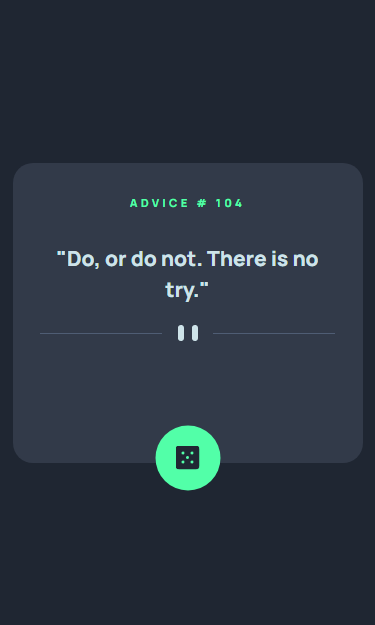

# Advice generator app solution

This is a solution to the [Advice generator app challenge on Frontend Mentor](https://www.frontendmentor.io/challenges/advice-generator-app-QdUG-13db). Frontend Mentor challenges help you improve your coding skills by building realistic projects.

## Table of contents

- [Overview](#overview)
  - [The challenge](#the-challenge)
  - [Screenshot](#screenshot)
  - [Links](#links)
- [My process](#my-process)
  - [Built with](#built-with)
- [Author](#author)

## Overview

### The challenge

Users should be able to:

- View the optimal layout for the app depending on their device's screen size
- See hover states for all interactive elements on the page
- Generate a new piece of advice by clicking the dice icon

### Screenshots

Active State

Desktop Version

Mobile Version

### Links

- Solution URL: [click here](https://github.com/vasilemidrigan/advice-generator-app)
- Live Site URL: [click here](https://vasilemidrigan.github.io/advice-generator-app/)

## My process

### Built with

- JavaScript Fetch API
- Adviceslip API
- Flexbox
- CSS custom properties
- Mobile-first workflow
- Semantic HTML5 markup

## Author

- Website - [vasilemidrigan.github.io](https://vasilemidrigan.github.io/)
- Github - [vasilemidrigan](https://github.com/vasilemidrigan)
- LinkedIn - [Vasile Midrigan](https://www.linkedin.com/in/vasile-midrigan/)
- Frontend Mentor - [@vasilemidrigan](https://www.frontendmentor.io/profile/vasilemidrigan)
